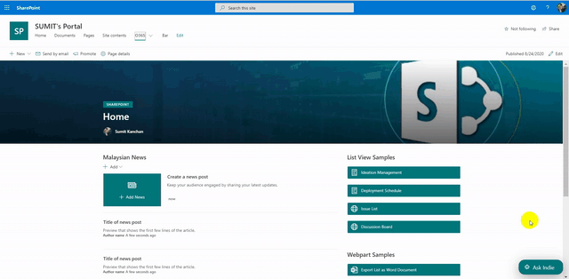

# SPFx QnA Bot
-----


## Summary

This is a SharePoint Framework Extension based QnA or chat bot that consumes the QnAMakper API to chat with the user. It is the extension so it is added to every page and makes the bot reachability easy

With some just configuration it is ready to use.





## Prerequisites

- Knowledge base needs to be created on qnamaker.ai - to know how click [here](https://docs.microsoft.com/en-us/azure/cognitive-services/QnAMaker/Quickstarts/create-publish-knowledge-base)


## Features

This is a QnA chat bot Extension which chats based upon the matches in the knowledge base

This extension illustrates the following concepts:

- Uses QnAMaker API to retreive the answers
- You can filter the results based on the metadata. Enter the configuration in the format 
```json
"[{name:'',value:''},{name:'',value:''},{name:'',value:''}]"
```

- If the filters are more than one, you can mention the operator for the filters possible values: `AND`, `OR`


## Configuration Deails
- Login to qnamaker.ai
- Navigate to your knowledge base you want to configure
- Navigate to settings and scroll to the bottom of the page
- Follow the below screen shot to identify the configuration parameters


## Solution

| Solution     | Author(s)     |
|--------------|---------------|
| SPFx QnA Bot | Sumit Kanchan |


## Disclaimer

**THIS CODE IS PROVIDED *AS IS* WITHOUT WARRANTY OF ANY KIND, EITHER EXPRESS OR IMPLIED, INCLUDING ANY IMPLIED WARRANTIES OF FITNESS FOR A PARTICULAR PURPOSE, MERCHANTABILITY, OR NON-INFRINGEMENT.**


